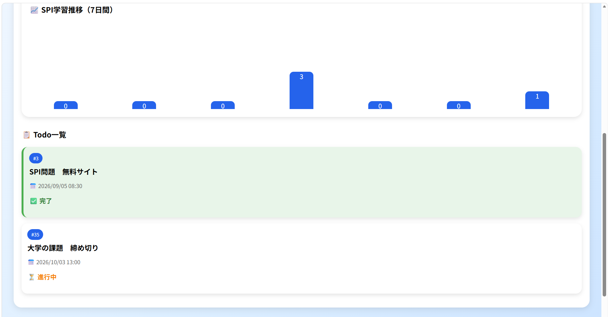
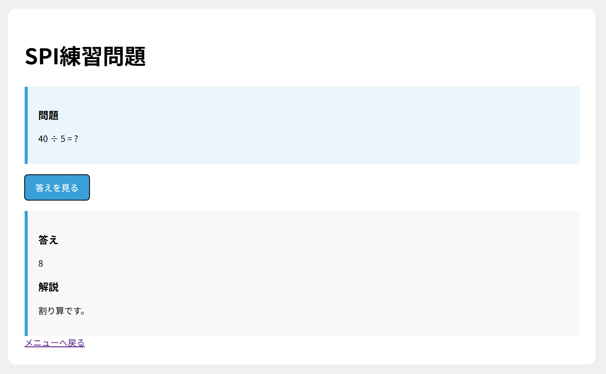
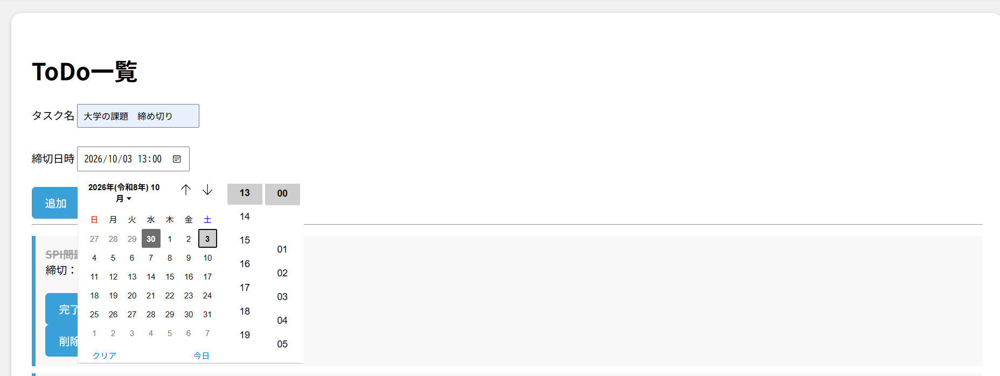
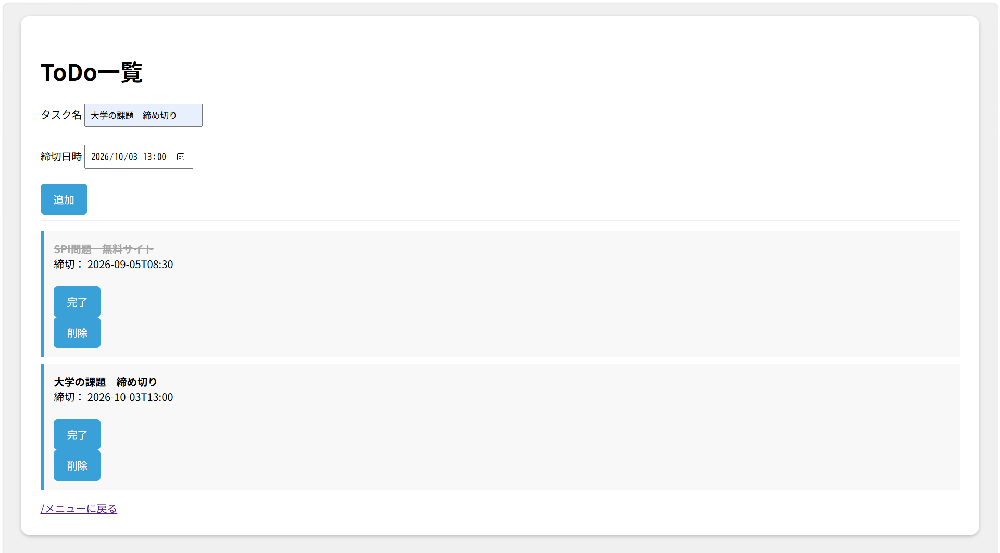
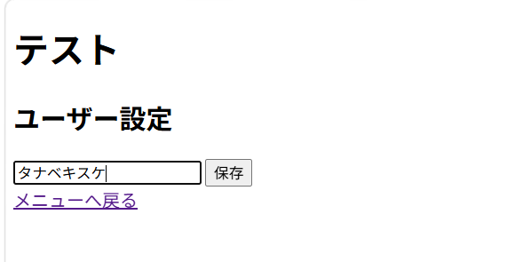
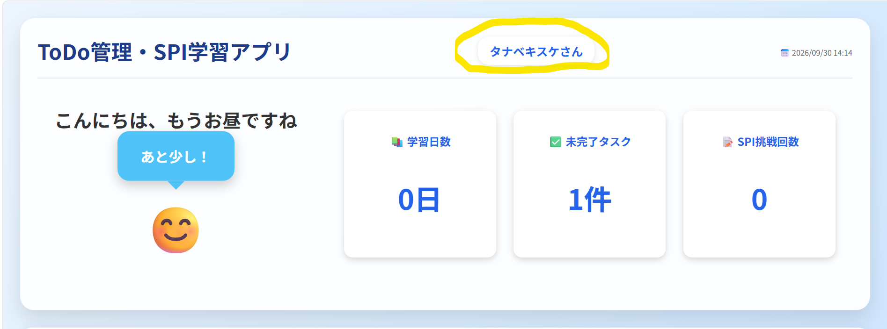

# ToDo管理・SPI学習アプリ

## 概要

Spring Bootを用いて開発した、ToDo管理とSPI学習を行えるWebアプリケーションです。

就職活動中のタスク管理とSPI対策を効率的に進められるように開発しました。

---

## 機能

### ToDo管理機能
- ToDo追加
- ToDo削除
- ToDo完了
- 締切日時設定
- タスク一覧表示

### SPI学習機能
- SPI問題生成
- 解答表示
- 解説表示

### ユーザー設定機能
- ユーザー名変更
- 設定内容の保存

### トップ画面機能
- 応援メッセージ表示
- 時間帯に応じたメッセージ切り替え
- 各画面へのナビゲーション

---

## 使用技術

### バックエンド
- Java
- Spring Boot
- Spring MVC

### フロントエンド
- HTML
- CSS
- Thymeleaf

### データベース
- H2 Database

### 開発ツール
- IntelliJ IDEA
- Git
- GitHub

---

## 工夫した点

- ToDo管理機能とSPI学習機能を1つのアプリに統合
- 時間帯に応じて応援メッセージを変更し、学習や就職活動のモチベーション向上を実現
- Thymeleafを利用した動的な画面表示
- 使いやすさを意識したシンプルなUI設計

---

# 画面イメージ

## トップ画面

### トップ画面①

### トップ画面②

### トップ画面③

---

## SPI問題画面

## Todo画面

### Todo画面①

### Todo画面②

### Todo画面③

## 設定画面

### 設定画面①

### 設定画面②

---

## 作成者

田邊 貴祐